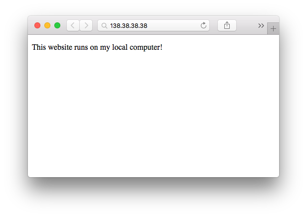

# docker-ssh-reverse-proxy
A simple way to expose Docker services to the outside world when they run on a host that doesn't have a public IP, like your personal computer... 

## Why is that useful?

Let's say you have website in a Docker container, running on your local computer (using Docker for Mac for example):

```shell
$ docker ps
CONTAINER ID        IMAGE               PORTS                NAMES
e33d5768853d        mywebsite           0.0.0.0:80->80/tcp   mywebsite
```

You want to show it to someone but your local computer isn't reachable through a public IP. But you do have Docker installed on an other host, and this one does have a public IP! Still you want to keep your website on your local computer, you sure have good reasons.

You can use these 2 tiny Docker images (less than 10MB each) to create an ssh tunnel and expose your local service to the outside world. 

## How to use?

#### Prerequisites:

Make sure you have a service running on your local computer:

```shell
$ docker ps
CONTAINER ID        IMAGE               PORTS               NAMES
d1e35bd9438d        mywebsite           80/tcp              mywebsite
```

#### Run container on your private host:

You'll be prompted for a few things. Just answer with your own values. 

```shell
$ docker run -ti aduermael/ssh-reverse-proxy-private
public ip/domain:
# public IP or domain where your second Docker engine resides.
public port:
# the port to access your service on your public ip/domain.
public container ssh port:
# the ssh port the second container is going to use to accept ssh connections.
forward to private ip/domain:
# ip or container name, as on your private host (e.g. local computer)
on port:
# port to access your service on your private host (e.g. local computer)
Run aduermael/ssh-reverse-proxy-public container on 138.68.44.40 and use that key when prompted:

c3NoLXJzYSBBQUFBQjNOem...


When done, press any key to continue...
```

#### Run container on your public host:

```shell
$ docker run -ti -p 80:80 -p 2222:22 aduermael/ssh-reverse-proxy-public c3NoLXJzYSBBQUFBQjNOem...
SSH server ready! You can detach from that container (Ctrl+p, Ctrl+q) and resume setup in the other one.
```

Go back to the other container and press a key, you should see this log:

```shell
Tunnel is ready! You can now detach from that container (Ctrl+p, Ctrl+q).
```

#### That's it!

Your service is now available on a public IP, served through an ssh tunnel! 🎉




